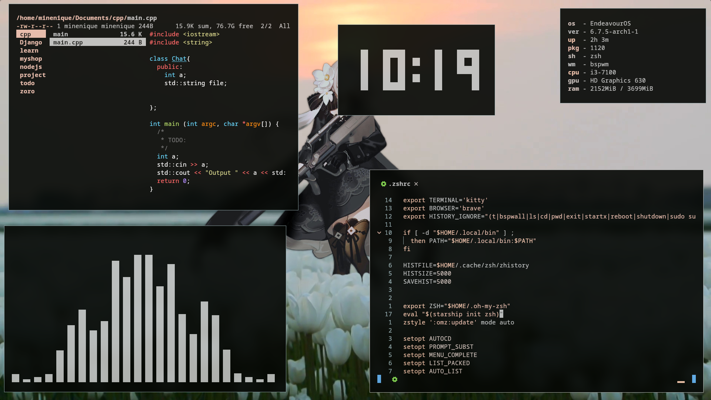
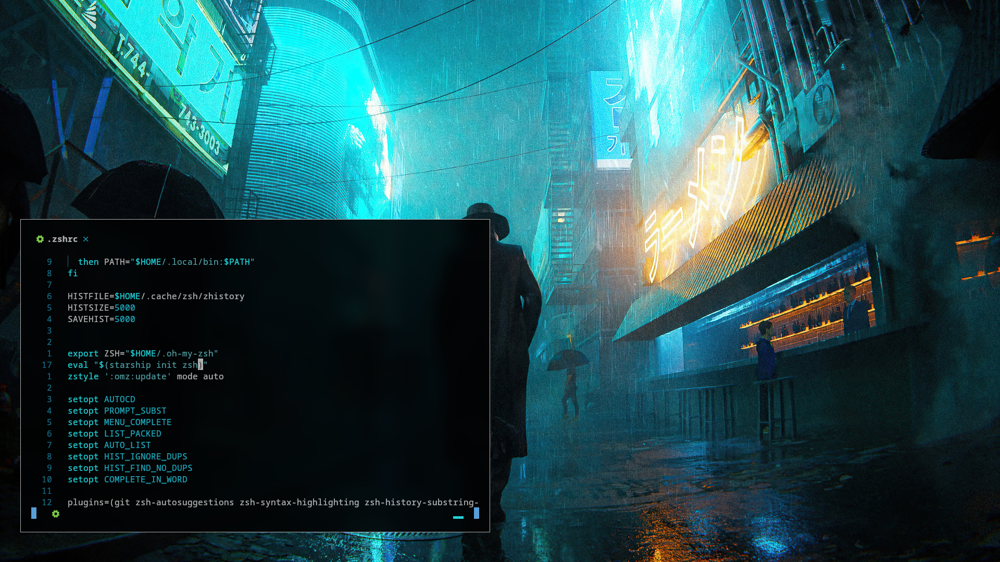

# **dotfiles**


| **wm**               | [bspwm](https://github.com/baskerville/bspwm)          |
| :------------------- | :----------------------------------------------------- |
| **term**             | [kitty](https://sw.kovidgoyal.net/kitty/)              |
| **fileman**          | [ranger](https://ranger.github.io/)                    |
| **brouser**          | [librewolf](https://www.librewolf.net/)                |
| **editor tui**      | [astronvim](https://astronvim.com/)                    |
| **editor gui**       | [vscodium](https://vscodium.com/)                      |
| **pdf**              | [zathura](https://pwmt.org/projects/zathura/)          |
| **video**            | [mpv](https://mpv.io)                                  |
| **music**            | [ncmpcpp](https://github.com/ncmpcpp/ncmpcpp)          |
| **fetch**            | [lmaofetch](https://github.com/p3nguin-kun/lmaofetch)  |
| **sysmon**           | [htop](https://htop.dev/)                              |
| **display manager**  | [ly](https://htop.dev/)                                |

# **installation**

**note: you need to login as normal user to use this script**

1. install [Git](https://git-scm.com/) if you don't have it

```
sudo pacman -S git
```

2. clone this repository

```
git clone git@github.com:MineNique/plane-dotfiles.git
``` 
- OR 

```
git clone https://github.com/MineNique/plane-dotfiles.git
```

3. go to dotfiles directory

```
cd dotfiles
```

4. run this script

```
chmod +x install && ./install
```

5. follow the instruction

6. restart your computer

7. done! Now you can use fully-featured floating/tiling window manager on your computer

**note**: if you dont have display manager (or login manager), you can login with xinit

```
startx
```

# **colorschemes**

there are pywal based colorschemes in my dotfiles, you can apply it by using `bspwall`

|                          |                          |                          |
| ------------------------ | ------------------------ | ------------------------ |
|  |  |  |
|  |  |  |
|  |  |  |
|                          |                          |                          |


# **tutorial**

- my dotfiles has a keybinding list, you can read it by pressing `` Super + ` `` or click [here](config/bspwm/sxhkdrc)
