<!-- Title -->
<h1 align="center"><strong>Dotfiles</strong></h1>
<p align="center">Fully-featured floating/tiling window manager-based dotfiles for GNU/Linux</p>

<!-- Introduction -->

## Introduction

This repository contains dotfiles for configuring various components of a GNU/Linux system, including window managers, terminals, file managers, browsers, editors, and more.

### Included Components:

| **Component**         | **Name**                                      |
| :-------------------- | :-------------------------------------------- |
| **Window Manager**    | [bspwm](https://github.com/baskerville/bspwm) |
| **Terminal Emulator** | [kitty](https://sw.kovidgoyal.net/kitty/)     |
| **File Manager**      | [ranger](https://ranger.github.io/)           |
| **Text Editor**       | [nvim](https://neovim.io/), [lvim](https://www.lunarvim.org/) |
| **PDF Viewer**        | [zathura](https://pwmt.org/projects/zathura/) |
| **Video Player**      | [mpv](https://mpv.io)                         |
| **Music Player**      | [spotify_player](https://github.com/aome510/spotify-player) |
| **System Monitor**    | [htop](https://htop.dev/)                     |
| **Display Manager**   | [ly](https://github.com/fairyglade/ly)        |

## Installation

1. Install [Git](https://git-scm.com/) if you don't have it:

   ```bash
   sudo pacman -S git
   ```

2. Clone this repository:

   ```bash
   git clone git@github.com:xArcGit/dotfiles.git
   ```

   or

   ```bash
   git clone https://github.com/xArcGit/dotfiles.git
   ```

3. Navigate to the dotfiles directory:

   ```bash
   cd dotfiles
   ```

4. Copy the dotfiles to your home directory:

   ```bash
   cp -r config/* ~/.config
   ```
   ```bash
   cp -r home/* ~/
   ```
    - check [Theme](theme/Readme.md)

5. Install the required packages

6. Enable the display manager:

   ```bash
   sudo systemctl enable ly.service
   ```

7. Restart your computer.

8. You're done! Now you can enjoy a fully-featured floating/tiling window manager on your GNU/Linux computer.

## Color Schemes

Use `Super` + `Alt` + `t` to change the color scheme.

### [Catppuccin](https://catppuccin.com/)

<p align="center">
  
  
  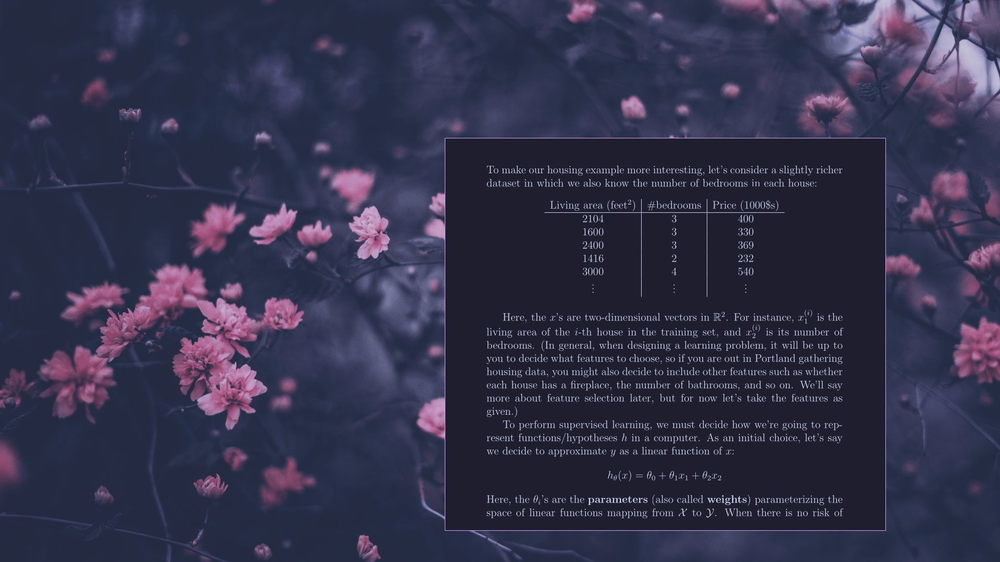
</p>
<p align="center">
  
  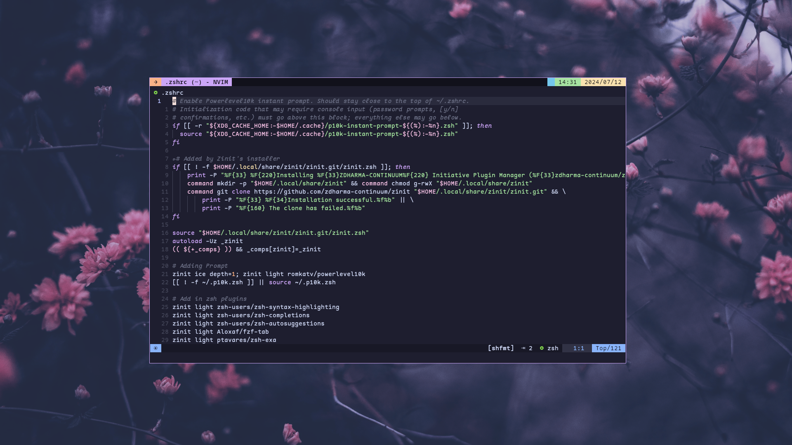
  
</p>

### [Everblush](https://everblush.github.io/)

<p align="center">
  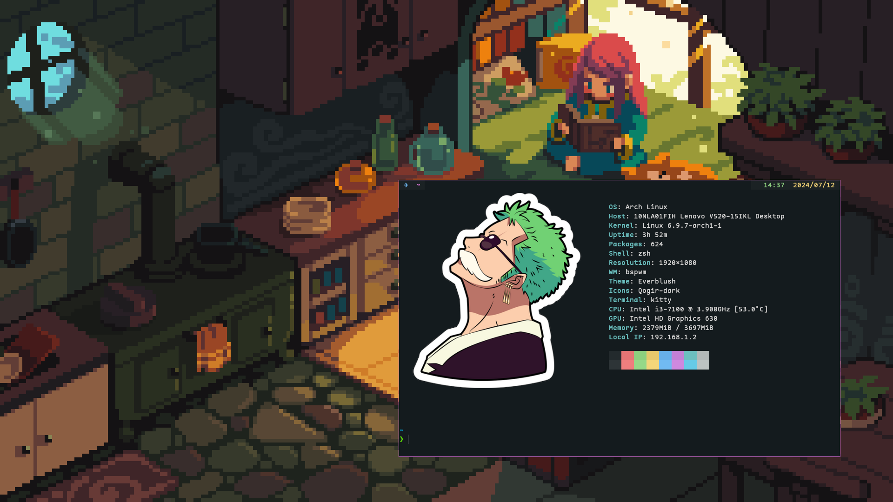
  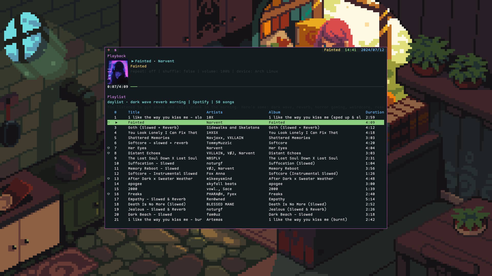
  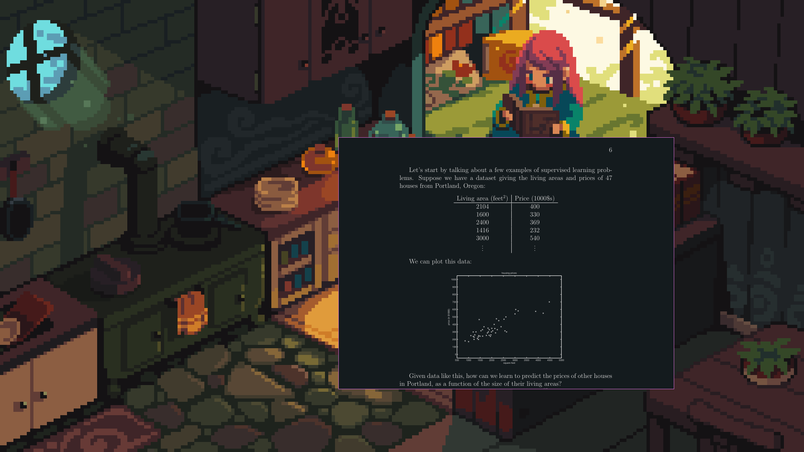
</p>
<p align="center">
  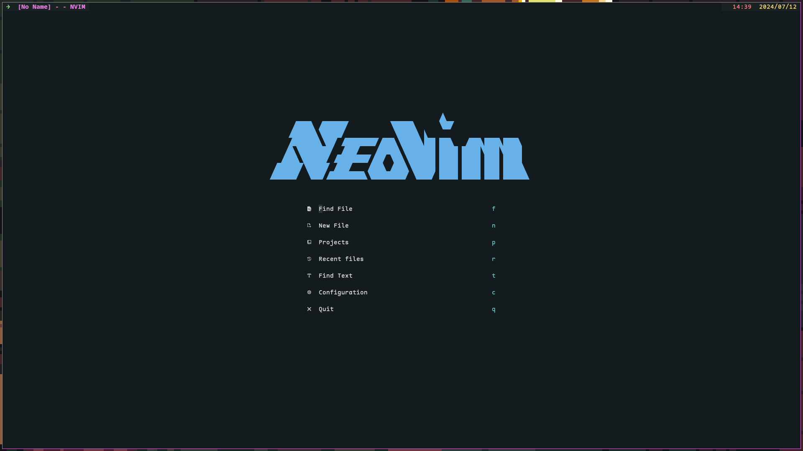
  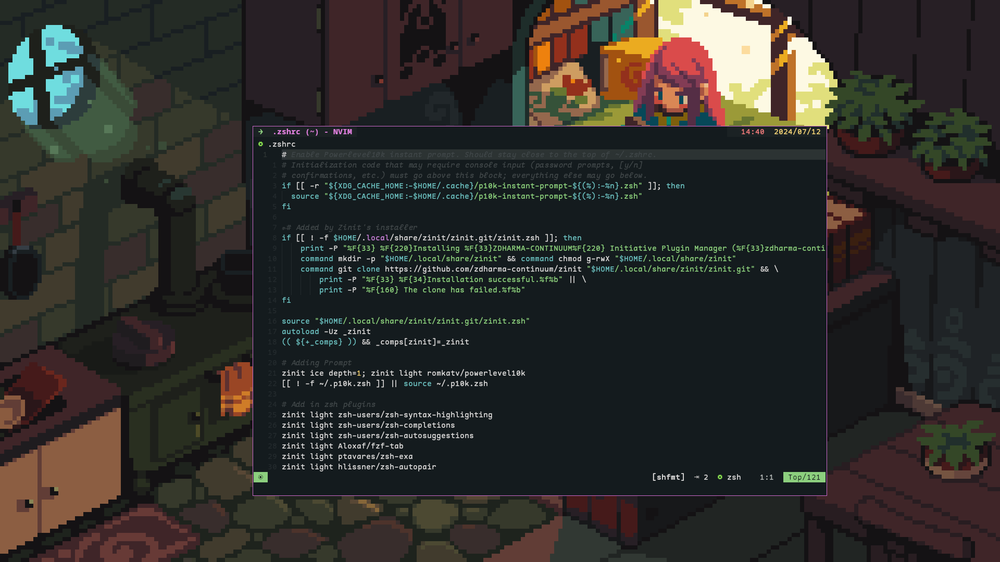
  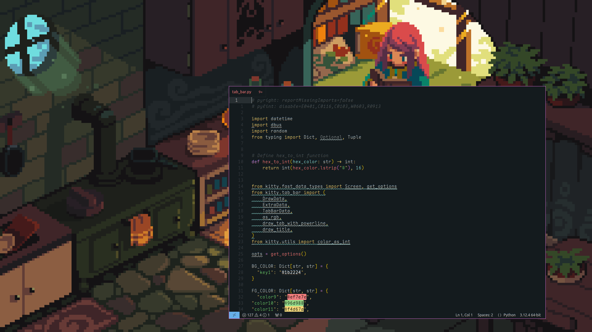
</p>

### [Tokyo Night]()

<p align="center">
  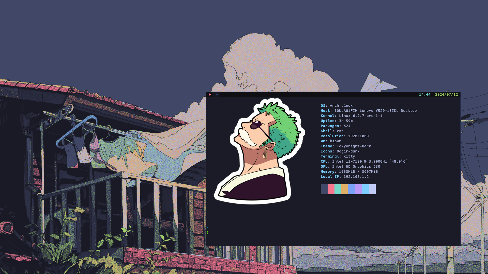
  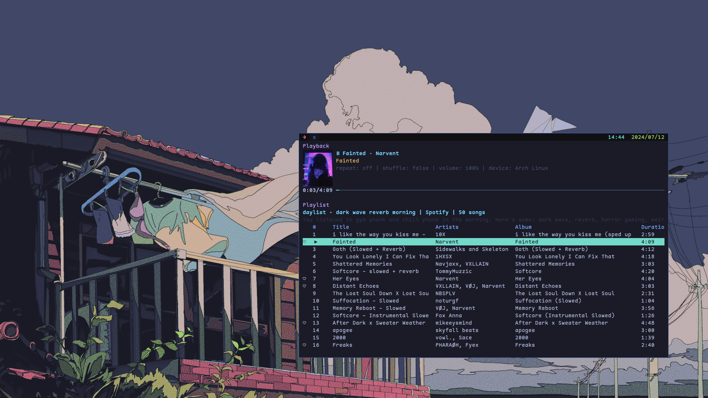
  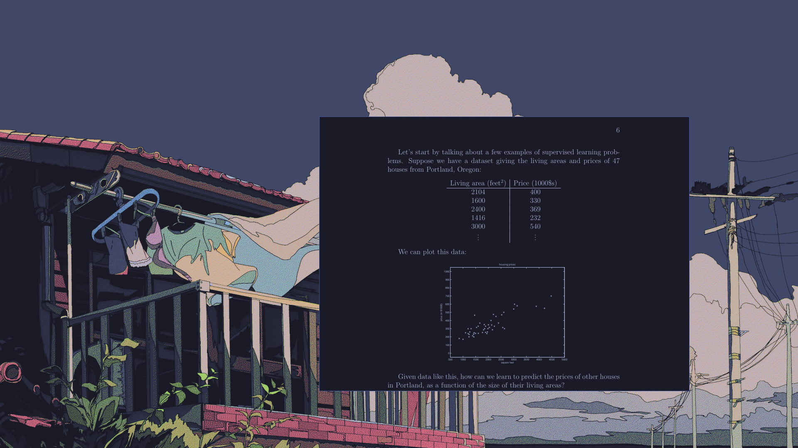
</p>
<p align="center">
  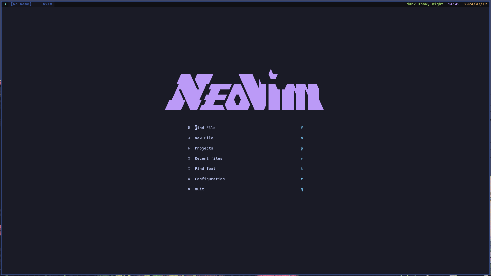
  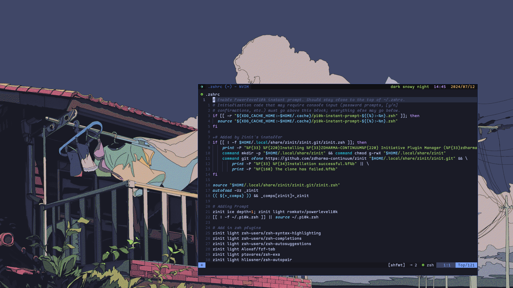
  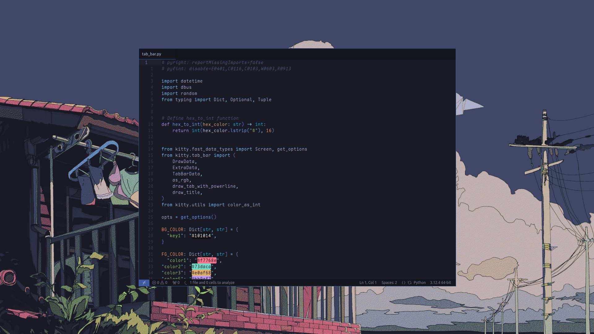
</p>

## Contributing

Contributions are welcome! Please feel free to open an issue or submit a pull request.

## License

This project is licensed under the [MIT License](LICENSE).
