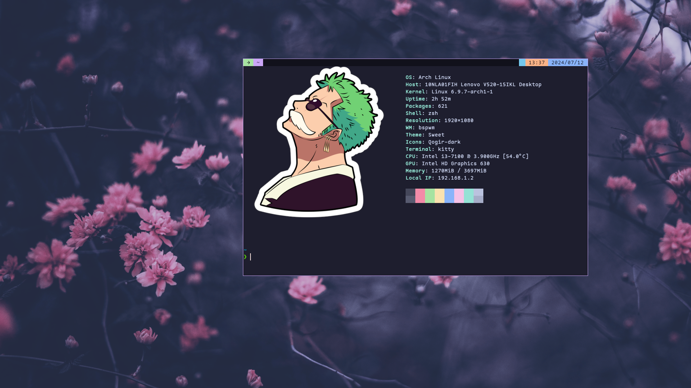
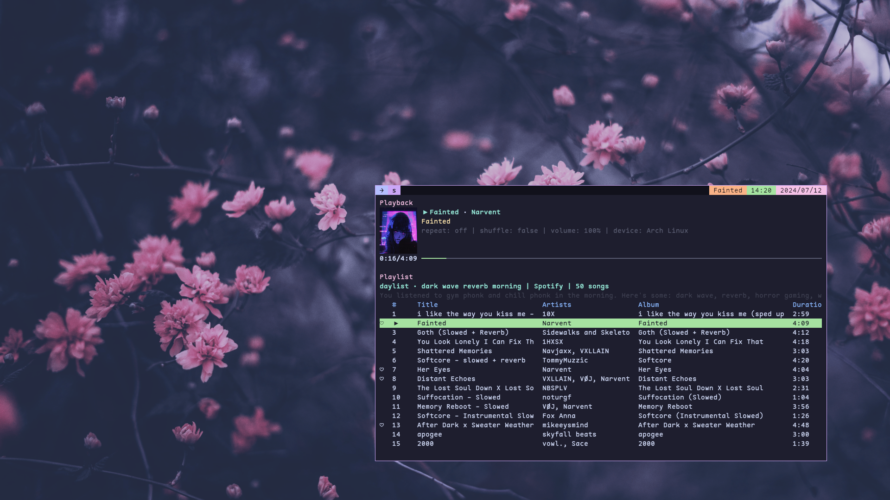
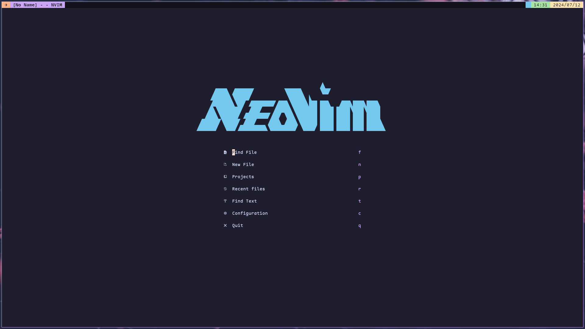
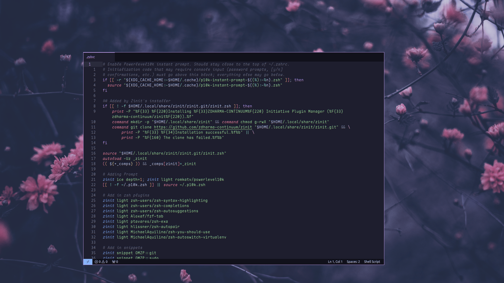

<!-- Title -->
<h1 align="center"><strong>Dotfiles</strong></h1>
<p align="center">Fully-featured floating/tiling window manager-based dotfiles for GNU/Linux</p>

<!-- Introduction -->

## Introduction

This repository contains dotfiles for configuring various components of a GNU/Linux system, including window managers, terminals, file managers, browsers, editors, and more.

### Included Components:


| **Component**         | **Name**                                      |
| :-------------------- | :-------------------------------------------- |
| **Window Manager**    | [bspwm](https://github.com/baskerville/bspwm) |
| **Terminal Emulator** | [kitty](https://sw.kovidgoyal.net/kitty/)     |
| **File Manager**      | [ranger](https://ranger.github.io/)           |
| **Text Editor**       | [nvim](https://neovim.io/)                    |
| **PDF Viewer**        | [zathura](https://pwmt.org/projects/zathura/) |
| **Video Player**      | [mpv](https://mpv.io)                         |
| **Music Player**      | [spotify_player](https://github.com/aome510/spotify-player) |
| **System Monitor**    | [htop](https://htop.dev/)                     |
| **Display Manager**   | [ly](https://github.com/fairyglade/ly)        |

## Installation

1. Clone this repository:

   ```bash
   git clone git@github.com:xArcGit/dotfiles.git
   ```

   or

   ```bash
   git clone https://github.com/xArcGit/dotfiles.git
   ```

2. Navigate to the dotfiles directory:

   ```bash
   cd dotfiles
   ```

3. Run script:
   ```bash
   chmod +x setup
   ./setup
   ```

4. Install the required packages
  - check [Theme](theme/Readme.md)

## Color Schemes

### [Catppuccin](https://catppuccin.com/)

<p align="center">
  
  
  
</p>
<p align="center">
  
  
  
</p>


## Contributing

Contributions are welcome! Please feel free to open an issue or submit a pull request.

## License

This project is licensed under the [MIT License](LICENSE).
